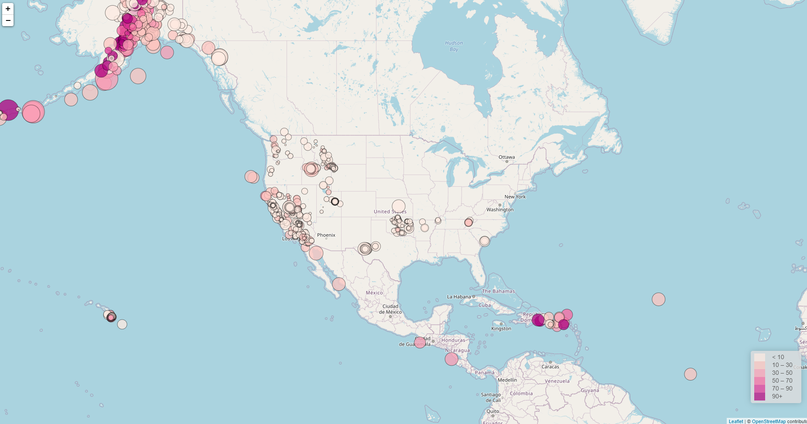

# Visualizing Earthquakes with Leaflet
## Objective: 
* Obtain the "All Earthquakes from the Past 7 Days" dataset from the [United States Geological Survey (USGS) GeoJSON Feed](http://earthquake.usgs.gov/earthquakes/feed/v1.0/geojson.php).
* Create a map using Leaflet that plots earthquakes based on their longitude and latitude.
* Create data markers that reflect the magnitude of the earthquake by their size and depth of the earthquake by color. 

    * Earthquakes with higher magnitudes should appear larger.
    * Earthquakes with greater depth should appear darker in color.

## Results:
The Leaflet map can be viewed [here](https://amberleebme.github.io/visualizing-eathquakes) and resembles the screenshot below.

